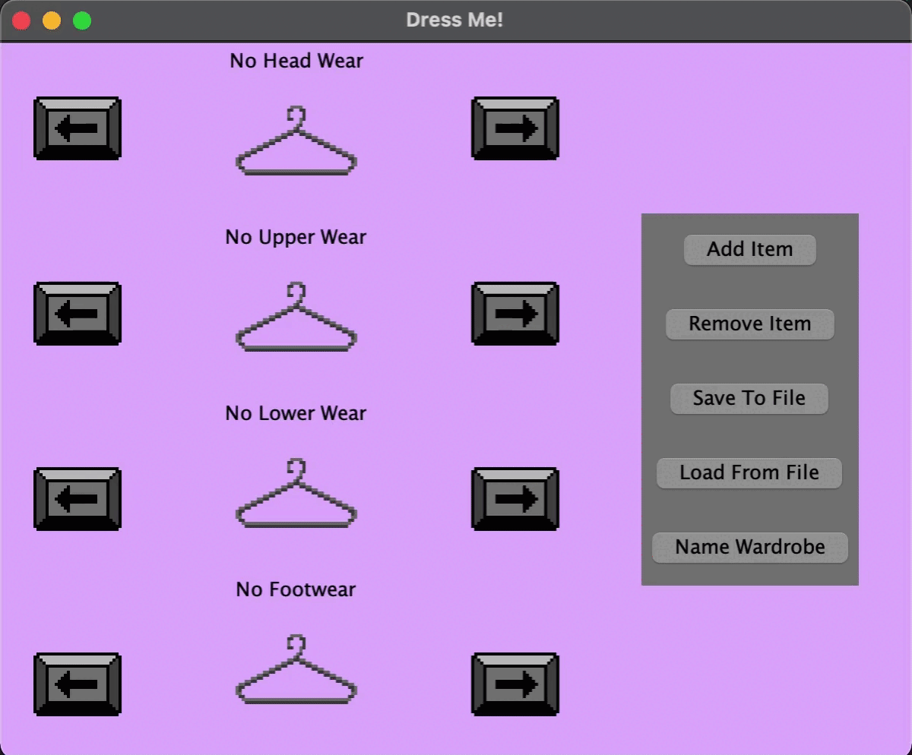
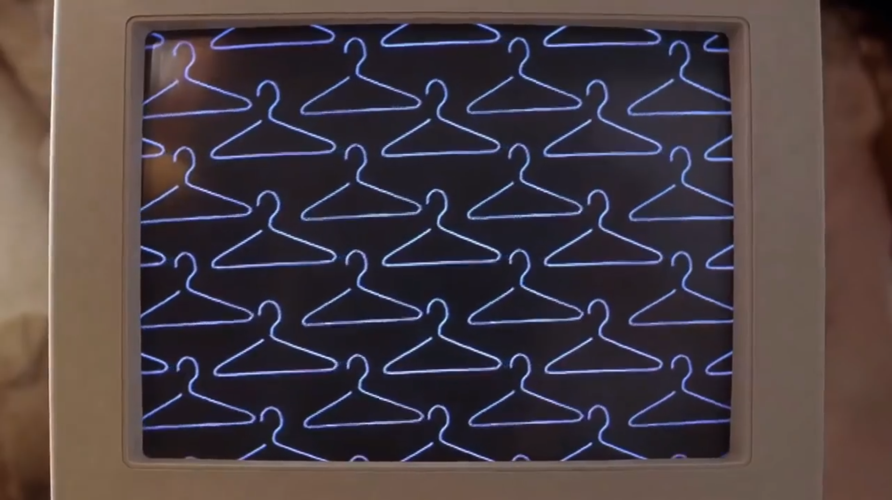
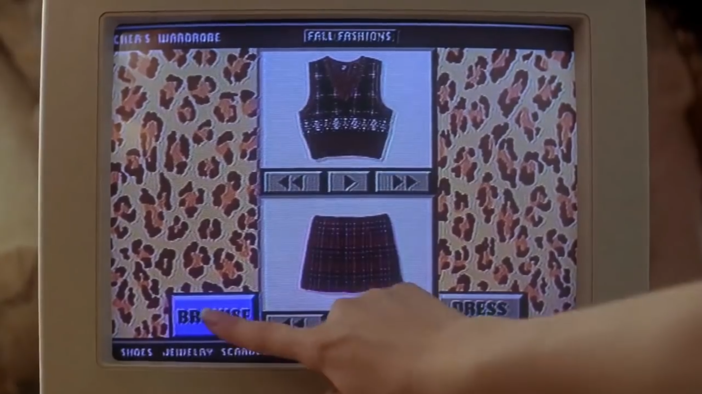
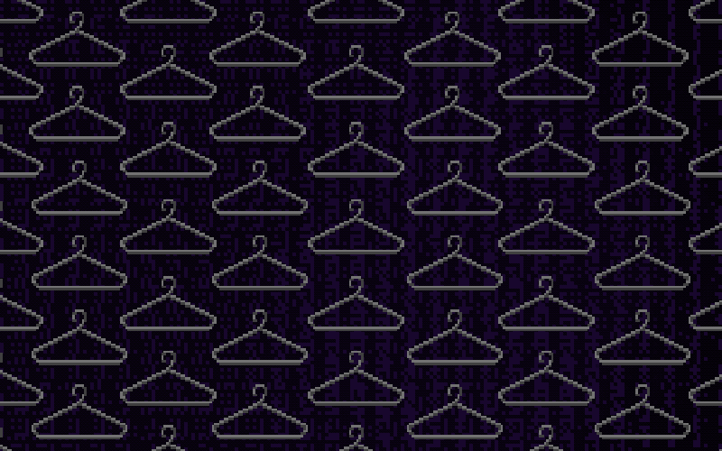

# Dress Me!
## A Pixel-Art Wardrobe Manager
[Overview](#a-quick-overview) | [Interest](#why-is-this-project-of-interest-to-me?) | 
[Functionality](#current-functionalities) | [Inspiration](#a-note-on-the-visual-inspiration) |
[Pixel-art](#pixel-art-application-segments)

### A Quick Overview
"Dress Me" acts as a Wardrobe tracker, that can keep a record of all the clothing items an individual owns.
The application keeps information like the *kind* of attire (formal, casual, sportswear, etc.) and colour and creates
potential outfit or pairing ideas. It was initially designed for my CPSC210 Personal Project however it has well-exceeded
its initial specifications.

### Why is this project of interest to me?
In the introductory scene of the movie Clueless, the protagonist Cher uses a computer to browse through all the clothes 
in her wardrobe and tries to match pick an outfit. The program can inform her when an outfit isn't *fashionable* and 
even mock pictures of clothes up on a picture of her. This was an idea from 1995, but it stuck with me because of how 
much it made sense. Most people spend a decent amount of time getting ready for the day, which ends up using mental 
resources. Barack Obama has gone on record to say that he’s “trying to pare down decisions” and that he doesn’t want to 
make decisions on trivialities like food and clothing as he has “too many other decisions to make”. I personally don’t 
like spending time planning what I want to wear because I tend to have 5 or 6 deadlines a week, and so I wanted to build
something that could help people like me.

### Current Functionalities

- Add different clothing items to the digital wardrobe
- See all the clothing in the wardrobe
- Save all the clothing items to the wardrobe
- Load all the clothing items from a previous save file
- Save to multiple files
- Name the user wardrobe
- Pick clothing colour using a visual colour picker
- Different types of clothing have visually different pixel art sprites
- A Clueless themed splash screen is displayed at launch

### A Note on the Visual Inspiration

I wanted my project to be reminiscent of the 90's and early 2000s with a pixel art style layout, and even including
pixelated rectangular buttons like in the movie Clueless. To add to the complete feel of the application, I also
 added a pixel art style splash screen based on the original project! *(See Below)*

**Clueless (1995): Splash Screen**

**Clueless (1995): User Interface**

### Pixel Art Application Segments
**Replicated Splash Screen**

*Other Potential Functionalities to be added*
- See if a set of selected clothes is fashionable using colour harmonies
- Tracking recently worn or in-laundry items
- Showing all the available clothing or Clothing as a List
- Select One or two pieces of clothing and pick a thing to fit it (Uses the scheduling problem/heuristic algorithm)
- Be able to list and filter items in a list view
- Saving a set of clothes as an "Outfit" and add, remove and list them
